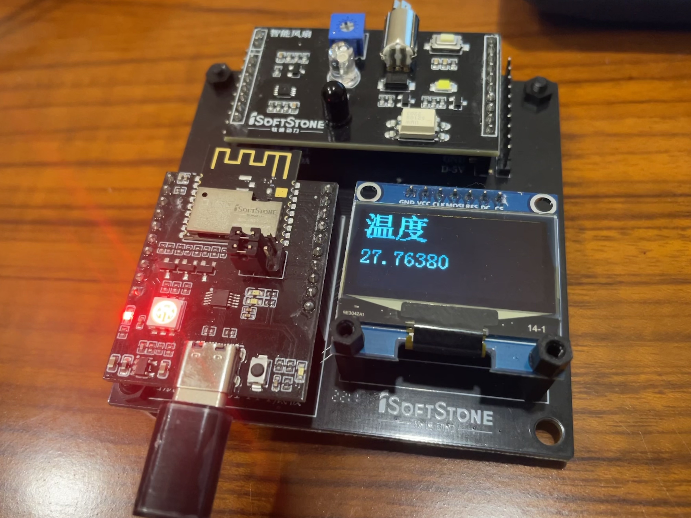
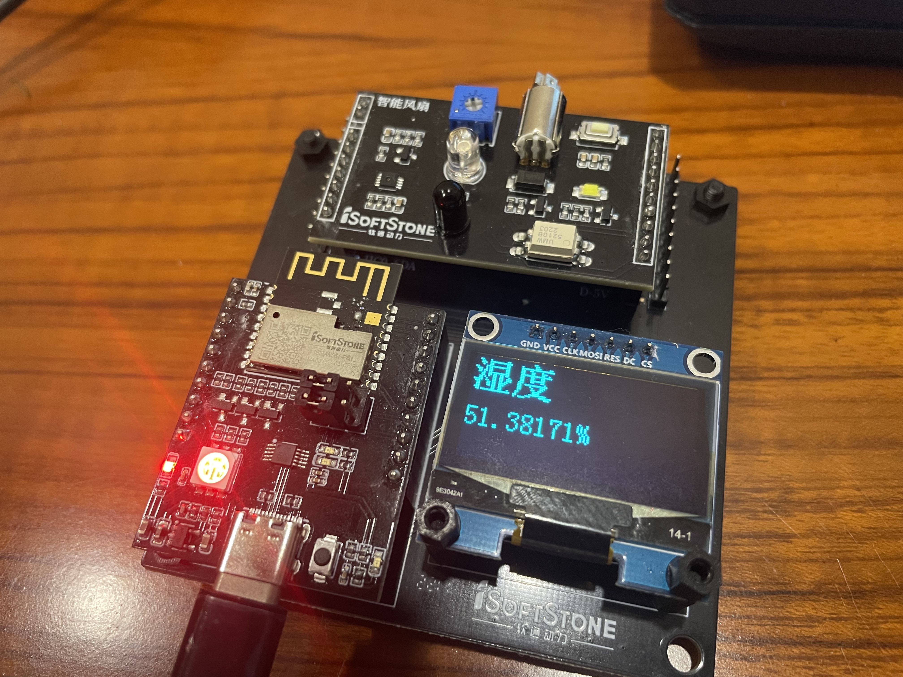
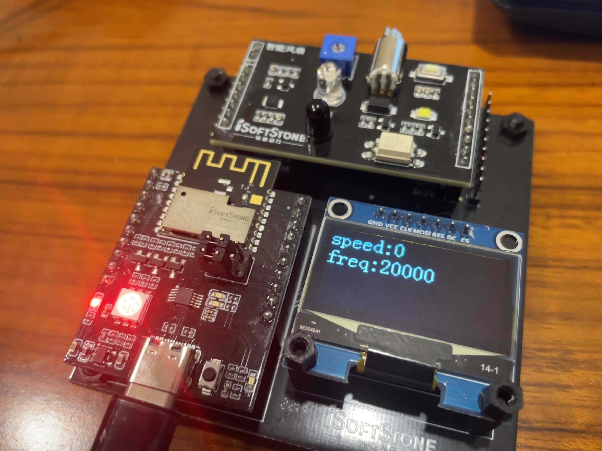
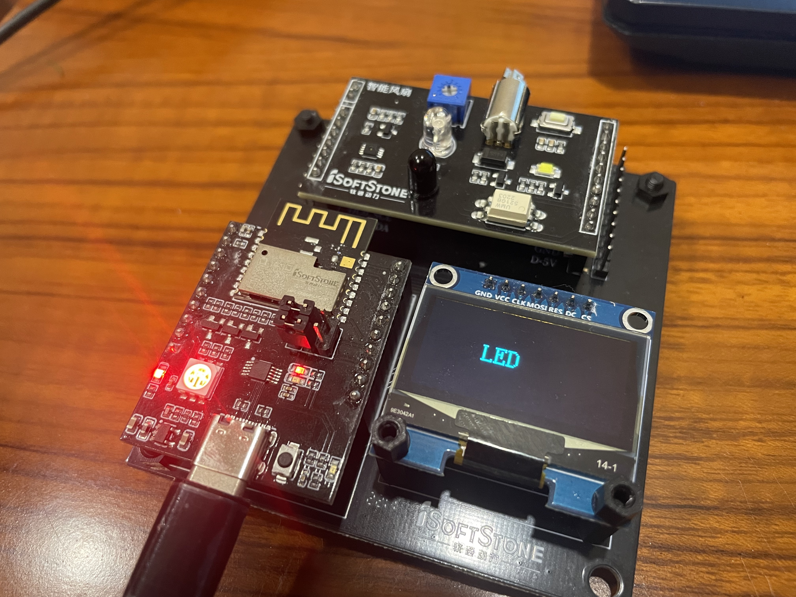
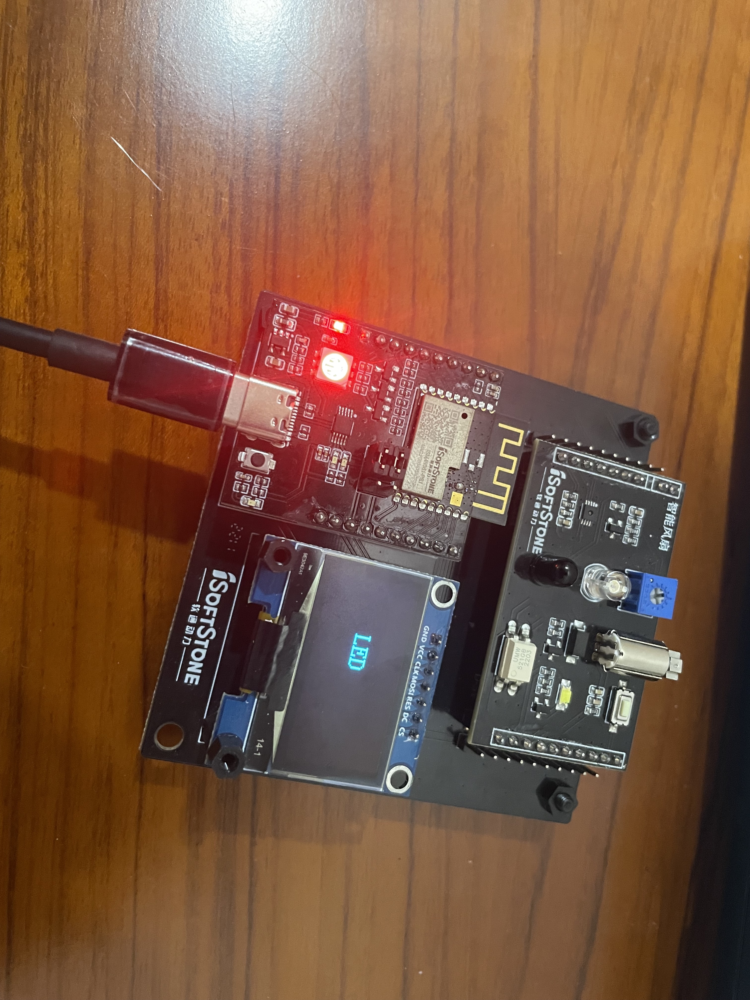
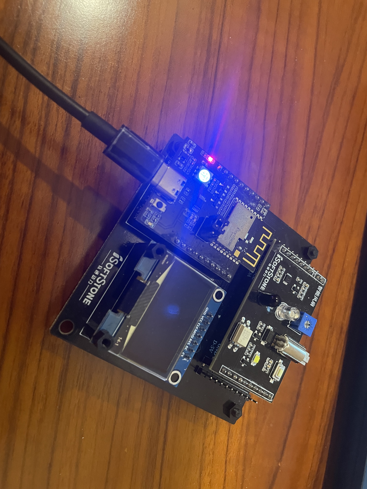
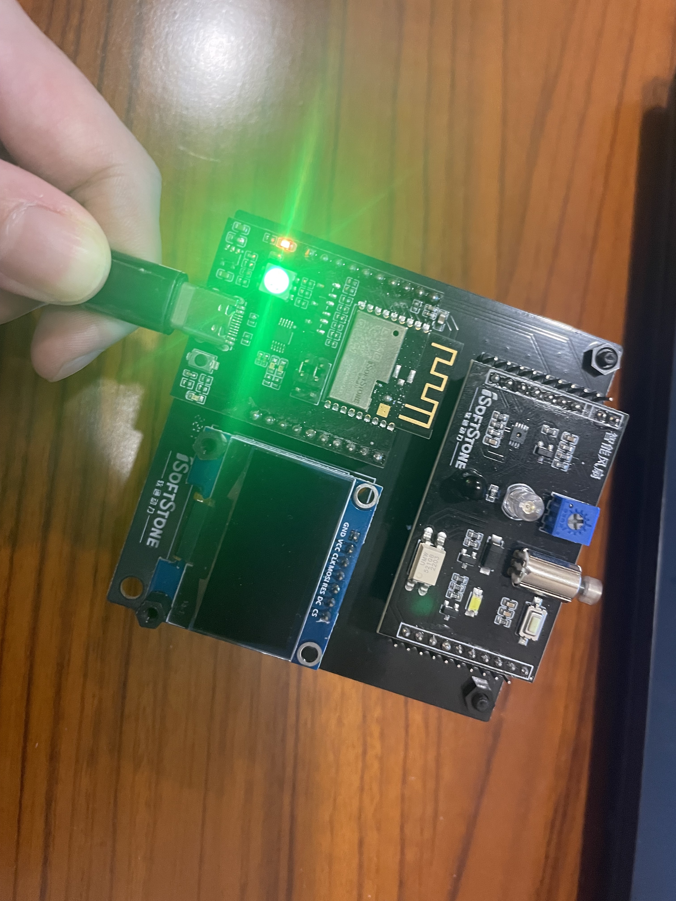
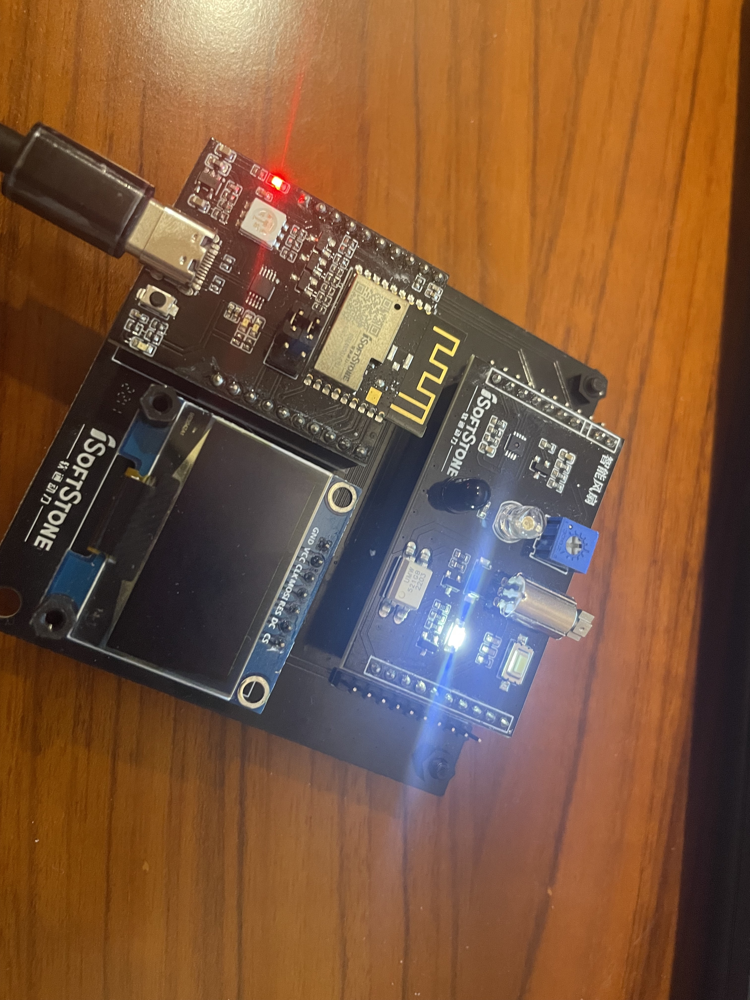
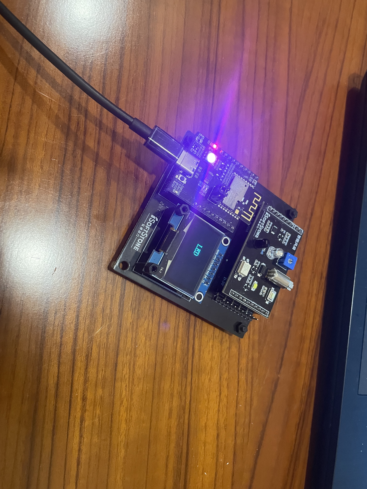

# 实验报告

姓名：王伟钊

学号：2020271040

## 一、项目简介

### 项目描述

#### 随着物联网时代的到来，越来越多的智能产品问世，网络作为全球发展速度最快，基础建设最完善的一个方向，我们应该抓住时代的机会，创造更多利用网络完善智能设备体验的项目。本项目作为物联网衍生产品之一，可以实现基本的人机交互以及通过网络远程控制LED灯，马达等功能

### 项目功能

* 通过SHT30 ，可以测量温度和湿度

* 可以通过远程MQTT协议下发命令，完成对马达的驱动

* 可以通过MQTT协议上报数据到华为IOT云平台

* 可以通过远程MQTT协议下发命令，驱动LED灯的开关

* 可以将温湿度数据显示在OLED屏幕上

* 可以将马达的速度和频率显示在OLED屏幕上

## 二、设计思路与方案

### 设计思路


### 设计方案

#### OLED

直接调用接口完成初始化

```c
void OLED_Init_GPIO(void);
void OLED_Init(void);
```

OLED屏幕存在四种不同的显示模式，在分别为

* mode_1:温度模式，在OLED显示实时测量的温度数值



* mode_2:湿度模式，在OLED显示实时测量的湿度数值



* mode_3:马达模式，下达马达相关命令后OLED会自动跳到此模式，OLED显示实时测量的马达速度以及马达频率



* mode_4:LED模式，下达LED相关命令后直接跳到此模式，



#### SHT30

使用I2C接口接收来自SHT30的数据和发布指令送给SHT30

```c
void initI2C()
{
    // 初始化io
    IoTGpioInit(I2C_SDA_GPIO_IDX);
    IoTGpioSetFunc(I2C_SDA_GPIO_IDX, IOT_GPIO_FUNC_GPIO_13_I2C0_SDA); // GPIO_0复用为I2C1_SDA
    IoTGpioInit(I2C_SCL_GPIO_IDX);
    IoTGpioSetFunc(I2C_SCL_GPIO_IDX, IOT_GPIO_FUNC_GPIO_14_I2C0_SCL); // GPIO_1复用为I2C1_SCL
    IoTI2cInit(WIFI_IOT_I2C_IDX_0, 400 * 1000);
    IoTI2cWrite(WIFI_IOT_I2C_IDX_0, (SHT30_ADDR << 1) | I2C_WRITE_FLAG, send_data, 2);//写入指令让SHT30重复采集数据
}
```

#### MQTT

##### 先完成网络的连接和校验，然后对json格式的文件进行组装和解构

##### json的组装

root作为根节点，从里到外一步一步拼接

```c
cJSON *services_arr = cJSON_AddArrayToObject(root, "services");
            cJSON *list = cJSON_CreateObject();
            cJSON_AddStringToObject(list, "service_id", "szfan");
            cJSON *properties = cJSON_CreateObject();
            cJSON_AddNumberToObject(properties, "temperature", g_temp);
            cJSON_AddNumberToObject(properties, "humidity", g_humi);
            cJSON_AddItemToObject(list, "properties", properties);
            cJSON_AddItemToArray(services_arr, list);
            char *palyload_str = cJSON_PrintUnformatted(root);
            strcpy(payload, palyload_str);
```

##### json的解构

root作为根节点先读取指令名字，再根据指令名字分析内部参数

```c
void jSONDeCode(cJSON *root)
{
    extern int mode;
    cJSON *cmd_type = cJSON_DetachItemFromObject(root, "command_name");
    cJSON *paras = cJSON_DetachItemFromObject(root, "paras");
    if (strcmp(cJSON_GetStringValue(cmd_type), "led_cmd") == 0)
    {
        cJSON *led_onoff = cJSON_DetachItemFromObject(paras, "led_onoff");
        char *string = cJSON_GetStringValue(led_onoff);
        if (mode != 4)
            mode = 4;
        sleep(1);
        if (strcmp(string, "BLUE_ON") == 0)
            Led_on_off(LED_ON, LED_GPIO_IDX_BLUE);
        else if (strcmp(string, "BLUE_OFF") == 0)
            Led_on_off(LED_OFF, LED_GPIO_IDX_BLUE);
        else if (strcmp(string, "RED_ON") == 0)
            Led_on_off(LED_ON, LED_GPIO_IDX_RED);
        else if (strcmp(string, "RED_OFF") == 0)
            Led_on_off(LED_OFF, LED_GPIO_IDX_RED);
        else if (strcmp(string, "GREEN_ON") == 0)
        {
            value = 5;
            IoTGpioSetFunc(LED_GPIO_IDX_GREEN, IOT_GPIO_FUNC_GPIO_2_GPIO);
            Led_on_off(LED_ON, LED_GPIO_IDX_GREEN);
        }
        else if (strcmp(string, "GREEN_OFF") == 0)
        {
            value = 0;
            Led_on_off(LED_OFF, LED_GPIO_IDX_GREEN);
        }
        else if (strcmp(string, "WHITE_ON") == 0)
            Led_on_off(LED_ON, LED_GPIO_IDX_WHITE);
        else if (strcmp(string, "WHITE_OFF") == 0)
            Led_on_off(LED_OFF, LED_GPIO_IDX_WHITE);
    }
    else if (strcmp(cJSON_GetStringValue(cmd_type), "motor_control") == 0)
    {
        if (mode != 3)
            mode = 3;
        sleep(1);
        IoTGpioSetFunc(MOTOR_GPIO, IOT_GPIO_FUNC_GPIO_2_PWM2_OUT);
        IoTPwmInit(MOTOR_PWM_CHN);
        cJSON *motor_spd = cJSON_DetachItemFromObject(paras, "motor_speed");
        value = (int)cJSON_GetNumberValue(motor_spd);
        cJSON *motor_freq = cJSON_DetachItemFromObject(paras, "motor_freq");
        freq = (int)cJSON_GetNumberValue(motor_freq);
        motor_speed(value, freq);
    }
    else if (strcmp(cJSON_GetStringValue(cmd_type), "switch_mode") == 0)
    {
        cJSON *modeNO = cJSON_DetachItemFromObject(paras, "mode");
        mode = cJSON_GetNumberValue(modeNO);
    }
}
```

#### 马达

直接调用GPIO_2号口即可控制马达，也可通过PWM的方式调整马达的转速和频率。

```c
int motor_Init()
{
    IoTGpioInit(MOTOR);
    IoTGpioSetFunc(MOTOR, IOT_GPIO_FUNC_GPIO_2_PWM2_OUT);
    IoTGpioSetDir(MOTOR, IOT_GPIO_DIR_OUT);
    IoTPwmInit(MOTOR_PWM_CHN);
}
```

```c
IoTPwmStart(MOTOR_PWM_CHN, level, freq);
```

#### LED

通过控制不同GPIO口对灯进行控制

* GPIO_2:绿灯(同时影响马达)

* GPIO_6:白灯

* GPIO_7:蓝灯

* GPIO_8:红灯(同时影响OLED屏幕)

#### 按键

可以切换不同的OLED显示模式，通过按键产生中断实现。同时可以令正在转动的马达停止转动，并设置速度为0。

## 三、成果展示











参考视频

[link](%E6%BC%94%E7%A4%BA%E8%A7%86%E9%A2%91.mp4)
